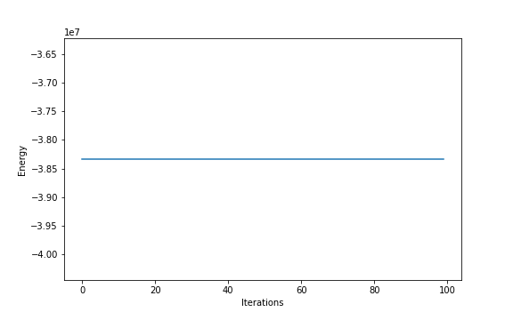
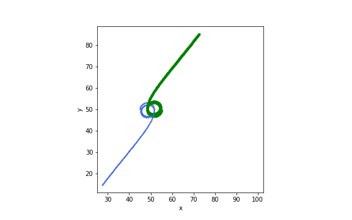
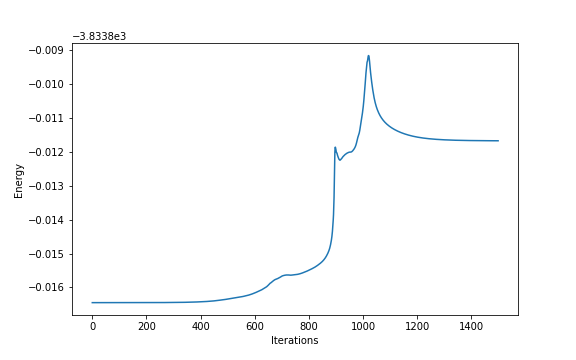
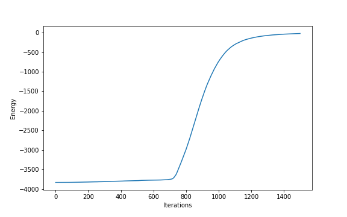

# Final Project: 3D Nbody Simulation.

The aim of the project is to make a 3-D nbody code that calculates the forces by computing the potential on a grid, the later being found by convolving the density with the (softened) potential from a single particle. To do so, I used a particle mesh method. The density was computed using the Nearest Grid Point (NGP) density scheme. The forces were then determined by taking the gradient of the potential and were assigned to each particles. Leapfrog integration with fixed time step was used to update the positions and velocities of the particles.

For each questions, I will provide a 3D animation of the particles trajectories and graph of the total system energy vs iterations. Unfortunately the positions and energy arrays I saved were too big for upload, but if you need the data just shoot me an email (killian.sheriff@mail.mcgill.ca).

Each initial conditions and additional comments can be found in the files Q{X}.py, X being the question number, as well as in the particle.py and nbody.py files where I defined useful classes for the simulations.

Have a nice winter break! :)

# Question 1:
A single particle starting at rest, remains motionless. The simulation was run on a 100x100x100 grid with time step 1 and 100 iterations. The energy is well conserved, the fluctuations are small.

# Question 2:
The pair is separated by 10 units in the x direction. Particle 1 had initial velocity (0,0.5,0) and particle 2 (0,-0.5,0). The softening constant was set to 1.
Note however that the trajectory of the particle are not perfectly circular, and that, after a certain time, keeping them in orbit is difficult. This is probably because the forces felt by the bodies are determined by the potential at grid points. However, we can only approximate a perfect circle with squares. Thus, our non-infinite grid size implies that the potential of their circular path is not perfect and so the bodies can be attracted by other grid cells, thus eventually making the orbit bigger and breaking it. Considering the grid size of 100x100x100, the energy looks well preserved.

# Question 3:
100 000 particles were randomly positioned on the grid, with equal masses of 1/100000 and initial velocities (0,0,0). The softening constant for both cases was set to be 0.8 and I used 1500 iterations with a step dt of 5.

## Periodic BC
The particles group in clusters. A lot of smaller structures resembling stars or galaxies are formed. As times goes, they grow into bigger clusters until they all collapse in one big "blob". Finally they disoveld due to the softening: the blob "explodes" since due to softening, the particles do not feel a force when they are too close, and just pass right through each other at high speed.
In this case, energy is relatively well conserved (even though slightly increasing), as expected since all particle are conserved.

## Non-Periodic BC
All particles collapse towards the point of higher density quicker, as there is nothing counterbalancing on the edges (no periodic boundary conditions). After the collapse, the particles get scattered around again due to softening, and are ejected out of the frame. The energy is thus not well conserved since we are loosing particles.

# Question 4:
We scaled the masses of the particle proportionally to the power spectrum. Again, we used 100 000 particles, 100x100x100 grid, but this time a way higher dt (400) as the structures are way more stable. The softening was set to 10. It is run for 1000 iterations.
We can notice filament like structure, kind of looking like spider webs; or even better, looking like our actual universe. The stability could be explain by the fact that we have points with very high mass density and others with very low mass density.
The energy looks well conserved.

